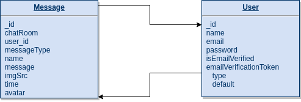
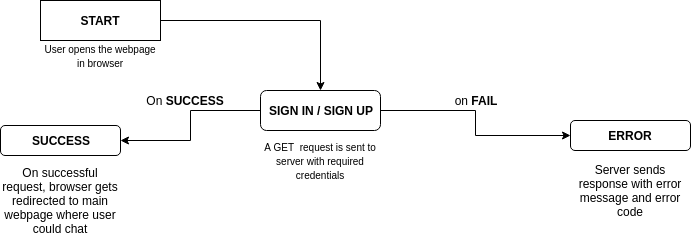
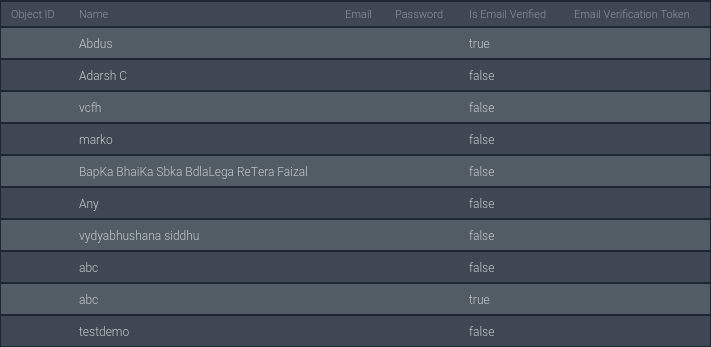
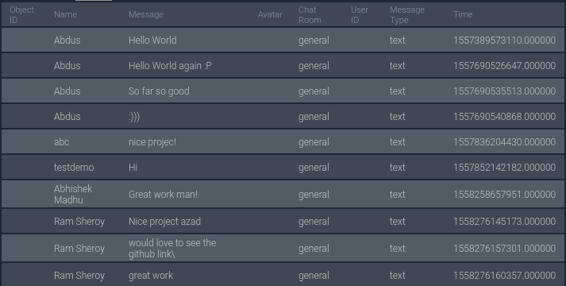
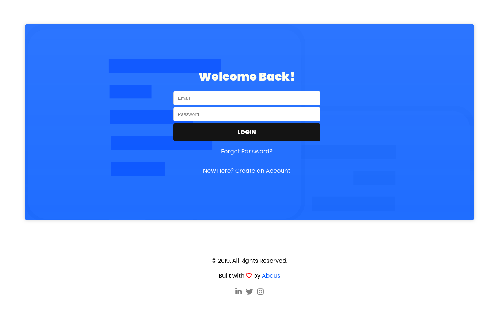
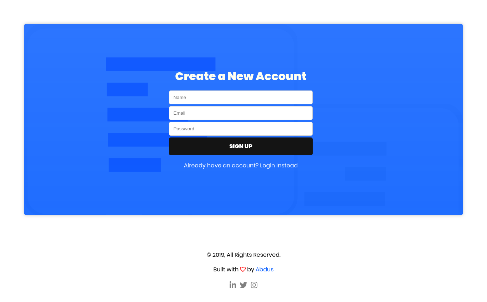
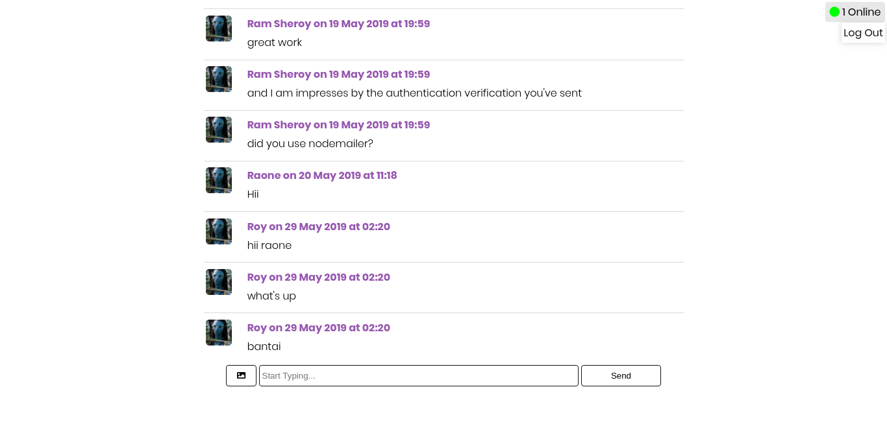

<!-- Section: License -->
<h1 style="text-align: center">LICENSE</h1>

\n

Copyright **2019** **Abdus Samad Azad**

Permission is hereby granted, free of charge, to any person obtaining a copy of this software and associated documentation files (the "Software"), to deal in the Software without restriction, including without limitation the rights to use, copy, modify, merge, publish, distribute, sublicense, and/or sell copies of the Software, and to permit persons to whom the Software is furnished to do so, subject to the following conditions:

The above copyright notice and this permission notice shall be included in all copies or substantial portions of the Software.

THE SOFTWARE IS PROVIDED "AS IS", WITHOUT WARRANTY OF ANY KIND, EXPRESS OR IMPLIED, INCLUDING BUT NOT LIMITED TO THE WARRANTIES OF MERCHANTABILITY, FITNESS FOR A PARTICULAR PURPOSE AND NONINFRINGEMENT. IN NO EVENT SHALL THE AUTHORS OR COPYRIGHT HOLDERS BE LIABLE FOR ANY CLAIM, DAMAGES OR OTHER LIABILITY, WHETHER IN AN ACTION OF CONTRACT, TORT OR OTHERWISE, ARISING FROM, OUT OF OR IN CONNECTION WITH THE SOFTWARE OR THE USE OR OTHER DEALINGS IN THE SOFTWARE.

\n\n\n\n\n\n\n\n\n\n\n\n\n\n\n\n\n

<!-- Section 0: Certificate -->

<h1 style="text-align: center">CERTIFICATE</h1>

\n

I, **Abdus Samad Azad** (UT1712910001) certify that the BCA Pre-Final year Project Report entitled
“Development of Chat Web Application” is done by me and my partner and it is an authentic work carried out by me at Anandaram Dhekial Phookan College. The matter embodied in this project work has not been submitted earlier for the award of any degree or diploma to the best of my knowledge and belief.
\n\n
**Signature of the Student**
Date:
\n\n
Certified that the Project Report entitled "**Development of Online Chat Web Application**” done by the above student is completed under my guidance.
\n
**Signature of the Supervisor**  
Date:
\n
**Organisation Name**: Anandaram Dhekial Phookan College, Nagaon

\n\n\n\n\n\n\n\n\n\n\n\n

<!-- Section: 0.1: Undertaking -->
<h1 style="text-align: center">UNDERTAKING: ANTI-PLAGIARISM</h1>
\n\n
I, hereby, declare that the material/ content presented in the report are free from plagiarism and is properly cited and written in my own words. In case, plagiarism is detected at any stage, I shall be solely responsible for it.

\n\n
**Signature of Student**
Abdus Samad Azad
UT1712910001

\n\n\n\n\n\n\n\n\n\n\n\n\n\n\n\n\n\n\n\n\n\n\n\n\n\n

<!-- Section: 0.2:ACKNOWLEDGEMENTS  -->
<h1 style="text-align: center">ACKNOWLEDGEMENTS</h1>

\n

The success and completion of this project requires a lot of guidance and assistance from many peoples and I am extremely fortunate to get all these along with the completion of our project work.
I would like to take this opportunity to express our gratitude towards all the people who have in various ways, helped in the successful completion of our project.
I must thank Stack Overflow for helping me out everytime I encountered an error. I would like to thank Google and other awesome websites and forums for helping me with the information I needed. I would also like to thank those awesome developer whose libraries and packages I am using!
I would like to convey my gratitude to Mr. Deepjyoti Borah for his constant support and guidance through the tough as well as easy phases of the project in a result oriented manner with concern attention. I would also like to convey my gratitude to Mr. Dhiraj and Mr. Mayur Sir for helping me whenever I run into an issue.

\n\n\n\n\n\n\n\n\n\n\n\n\n\n\n\n\n\n\n\n\n\n

<!-- Table of content -->

# Table of Content

| Sl No | Title                            | Page No |
| :---: | :------------------------------- | :-----: |
|   1   | Certificate                      |   01    |
|   2   | Certificate: Anti - Plagiarism   |   02    |
|   3   | Undertaking                      |   03    |
|   4   | Acknowledgement                  |   04    |
|   5   | List of Tables/Figures/Symbols   |   05    |
|   6   | Introduction                     |   08    |
|   7   | System Analysis                  |   09    |
|   8   | System Requirement Specification |   10    |
|   9   | Use Case Description             |   11    |
|  10   | Testing                          |   12    |
|  11   | Source Code and Snapshots        |   13    |
|  12   | Conclusion and Future Work       |   14    |
|  13   | List of References               |   15    |

\n\n\n\n\n\n\n\n\n\n\n\n\n

<!-- Section 01:Inroduction -->

# Introduction

1. **Description of the Organization**: I am doing my BCA pre-final year project under Anandaram Dhekial Phookan College, Nagaon affiliated by Guwahati University.

2. **Data Collection**: In order to develop this web application, we collected data from verious sources. These data helped us developing this application in a smooth way. Following are a few of the places from where we collected our data:
   - **1:1 Discussion**: We talk about the idea with people from our friend circles. At first, we describe them our idea and asked what features they would like to see in the application.
   - **Group Discussion**: We raised about our project in a group of friends/classmates randomly and recorded their opinion about it.

\n\n\n

<!-- Section 02: System Analysis -->

# System Analysis

**Chat Application** is a web-based chat application which enables two human(or sometime, robots) message each other over the Internet. It works in real-time, means, the message an end-user types, gets _almost_ instantly delivered to the user on other end. This makes communication between two party flawless, easy and super fast!

This little application has so many advantages over a snailmail or even an email service. And a few disadvantages too! Let's talk about advantages first. Because, messages gets delivered almost instantly, users could communicate super faster! And hence, the less chances of miscommunication.

And the disadvantages are, well, let us know if you find any. We will try our best to fix that!

1. **Process(es)**: This application includes following Processes:

   - **Auth(Login/Signup)**: Authenactication process is one of the fundamental features in this application. This helps us, the developers, identify the users, adminstrating them etc.

   - **Live Chatting**: This is the process where the communication between two users happens.

2. **I/O of each Process(es)**:

   - **Auth**: User logs in by using email and password. When signing up, they have to provide a valid Email(for sending verification mail), Name, Password. If everything wents well, they will be registered in the database successfully.

   - **Chat**: User enters a message in chat-box, which is sent to server via AJAX call. User could also upload images, PNG etc which will be converted into base64 string before performing AJAX.

     | I/O    | DOM Element                 |
     | ------ | --------------------------- |
     | Login  | `email`, `password`         |
     | Signup | `email`, `password`, `name` |
     | Chat   | `message-box`               |

\n\n\n

# Software Specification

## Project Planning

The approach which is used to develop this application, is Feature Driven Development. FDD is methodology which comes under Agile Development. In this method, a software is developed completely based on the pre-determined feature.

We, a team of two students, developed this application from ground-up. And we learned a lot while we developed this application. Following are the names of the students:

1. **Abdus Samad Azad** (www.thisisabdus.dev)
2. **Shakir Ahmed**

Initial features we've planned for this project were:

- **User Authenatication**: We needed a way to identify who is sending a message. And for that, nothing else is better than authentication.
  - **Email Verification**: We certainly don't want the internet bots to sign-up automatically. We don't want people to mis-use it by using fake email addresses either. So, we've implemented this feature.
- **Live Messaging**: The most important feature.
- **Text to Speech**: Application could read the sent messages loud. This feature could help people who are visually-impaired to understand what other person has to say.
- **Status**: It should also display if an user is _typing_ a message. It should also inform who is actually typing the message.
- **Image Sharing**: _A picture is worth a thousand words_. So, the feature.

\n

## Project Perspective

This product is released under MIT Open-Source license. This product doesn't come with a warrenty. One could use it however they want to. Could modify the source code. And even release it again as a proprietary software. However, developers aren't responsible for any harm/damage caused by this software.

- **User Interface**
  User Interface of this software includes the following areas:

  - _Login/Signup Page_: Nicely-designed Login/Signup page for users to Login/Signup
  - _Messaging UI_: User Interface for sending messages

- **Hardware Interface**
  Minimum requirments for the web application are:

  - 1 GigaByte RAM
  - Dual Core CPU
  - 10 GigaByte of Storage

- **Software Interface**

  - Code Editor/IDE: For writing codes. I have used Visual Studio Code.
  - A reliable database: For storing presistant information. We are using MongoDB for this project.
  - Server: For serving static and dynamic content. We are using NodeJS for creating server and managing back-end codebase.
  - Version Control System: For managing codebase effectively.

- **Required Dependencies**
  Following are the libraries/frameworks this project depends upon.

  - **`@sendgrid/mail(`^6.3.1`)`**: An API wrapper library. It sends email using SendGrid's API. I am using this in order to send verification emails.

  - **`bcrypt(`^3.0.6`)`**: BCrypt is a library for hashing and salting passwords. I certainly don't want to store passwords in plain text like Facebook.

  - **`express(`^4.16.4`)`**: _NodeJS Framework Trusted By All_! A framework which helps developers creating and managing NodeJS servers easily.

  - **`cookie-parser(`^1.4.4`)`**: A library for parsing cookies from Express' raw `request` object.

  - **`dotenv(`^8.0.0`)`**: For loading envirnment variables from a `.env` file, all at once.

  - **`express-handlebars(`^3.0.2`)`**: Handlebars template engine implemented in ExpressJS with some added features.

  - **`jsonwebtoken(`^8.5.1`)`**: Package which generates a auth token. I am using this for authenatication.

  - **`mongoose(`^5.5.4`)`**: ORM driver for MongoDB. As MongoDB is a NoSQL database, mongoose helps in defining a schema.

  - **`socket.io(`^2.2.0`)`**: For creating websocket server and client.

  - **`Responsive Voice`**: Library for making the browser speak. I could've used the browser's API to accomplish this. But it might produce compatiblity issue.

* **Product Function**
  This web-application will allow only authorized user to access the main chat area. Unauthorized users must create a new account in order to get access to the main chat area. Following are the steps how this application works under the hood:

  - _Sign-up_: User register himself/herself by providing a valid email, name and a password. Once server recieves it, it will check if the email is already existed in database. If not, server will send a verification mail to the provided email.
  - _Sign-in_: User have to provide email and password in order to sign in. These informations will be sent to back-end via an AJAX call so that server could process it.
  - _Authentication_: Once server recieves email and password, it will start verifying email and password against database. If succeed, server will issue a new _json web token_(hence, authorizing the user to access protected resources) and send it back to front-end as a response of the previous AJAX call.
  - _Sending Messages_: When the user is authorized, he/she could send message by visiting message room(usually redirected automatically).

\n

## Software Requirement Specification

- **Physical Specification**

  **ERD Diagram**

  

  **DFD Diagram**

  

- **Input Specification**
  This block will help us understand what type of data is expected form a user.

  - _Input Name: Log-In_

    | Field Name | Field Type | Field Size (No of Characters) | Description                 |
    | :--------: | :--------: | :---------------------------: | :-------------------------- |
    |  `email`   |   String   |             Max\*             | stores email of the user    |
    | `password` |   String   |             Max\*             | stores password of the user |

  - _Input Name: Sign-up_

    | Field Name | Field Type | Field Size (No of Characters) | Description                 |
    | :--------: | :--------: | :---------------------------: | :-------------------------- |
    |  `email`   |   String   |             Max\*             | stores email of the user    |
    | `password` |   String   |             Max\*             | stores password of the user |
    |   `name`   |   String   |             Max\*             | stores Name of the user     |

    <sub>\*Number of Characters equivalant to 4 MegaByte</sub>

  - _Database Specification_: Following are the database collections for _user_ and _message_.
    **Fig: User Collection**
    

    **Fig: Message Collection**
    

\n\n\n

# Source Code And Snapshots

### Snapshots

- **Login Page**

  

- **Signup Page**

  

- **Chat Window**

  

### Source Code

Following are the source code we wrote while building this web-application

\n

**package.json**: It contains important information regarding the package(i.e. this application). This is basically a JSON file which must contain package version, package name, dependency list etc. And may contain npm-scripts which is used to automate the development process.

```json
{
  "name": "chatter-box",
  "version": "0.0.1",
  "description": "Channel based chat app",
  "main": "app.js",
  "homepage": "https://quick-chat.now.sh",
  "scripts": {
    "test": "echo \"Error: no test specified\" && exit 1",
    "start": "NODE_ENV=production node app.js",
    "start:dev": "nodemon app.js",
    "md2pdf": "markdown-pdf -s /home/lxde/Documents/projects/github/chat-app/docs/project-report.css",
    "deploy": "now --target production --public"
  },
  "engines": {
    "node": "12.2.0"
  },
  "author": "@thisisAbdus <dev.abdus@gmail.com>",
  "license": "MIT",
  "dependencies": {
    "@sendgrid/mail": "^6.3.1",
    "bcrypt": "^3.0.6",
    "cookie-parser": "^1.4.4",
    "dotenv": "^8.0.0",
    "express": "^4.16.4",
    "express-handlebars": "^3.0.2",
    "jsonwebtoken": "^8.5.1",
    "mongoose": "^5.5.4",
    "socket.io": "^2.2.0"
  },
  "devDependencies": {
    "chokidar": "^3.0.0",
    "duplexer": "^0.1.1",
    "markdown-pdf": "^9.0.0",
    "split": "^1.0.1",
    "through": "^2.3.8"
  }
}
```

\n

**app.js**: `app.js` is the entry point of this project. This file is to be run in order to start this application.

```js
const dotenv = require('dotenv').config();
const express = require('express');
const socket = require('socket.io');
const exphbs = require('express-handlebars');
const cookieParser = require('cookie-parser');
const routes = require('./routes/routes');
const { userSchema, messageSchema } = require('./db');
const { decodeToken } = require('./auth/jwt.auth');

// app setup
const app = express();
const server = app.listen(process.env.PORT || 3000, () =>
  console.log('Listening on 3000')
);

// view engine
app.engine('hbs', exphbs({ defaultLayout: 'main', extname: 'hbs' }));
app.set('view engine', 'hbs');

// middleware
app.use((req, res, next) => {
  // req.port = server.address().port;
  next();
});
app.use(express.static('static'));
app.use(express.json({ limit: '50mb' }));
app.use(cookieParser());
app.use(express.urlencoded({ extended: false, limit: '50mb' }));
app.use(routes);

// socket.io setup
let io = socket(server);
let totalConnectedClient = {};

io.on('connection', socket => {
  let roomName = socket.handshake.query.roomname;
  socket.join(roomName);

  totalConnectedClient[roomName] = totalConnectedClient[roomName]
    ? totalConnectedClient[roomName] + 1
    : 1;

  // on socket disconnection
  socket.on('disconnect', socket => {
    totalConnectedClient[roomName] = totalConnectedClient[roomName]
      ? totalConnectedClient[roomName] - 1
      : 1;
  });

  // emit a new chat message
  socket.on('chat', data => {
    decodeToken(data.jwt)
      .then(async d => {
        console.log(d);
        const user = await userSchema.findById(d.id);
        console.log(decodeToken(data.jwt));
        data.name = user.name;

        io.to(roomName).emit('chat', data);
        data = new messageSchema({
          chatRoom: data.chatRoom,
          user_id: user._id,
          messageType: data.type,
          name: user.name,
          message: data.message,
          imgSrc: data.imgSrc,
          time: data.time,
          avatar: data.avatar,
        });
        data.save();
      })
      .catch(e => {
        console.log(e.message);
      });
  });

  // typing... status
  socket.on('typing', data => {
    decodeToken(data.jwt)
      .then(async d => {
        const user = await userSchema.findById(d.id);
        data.name = user.name;
        data.onlineCount = totalConnectedClient;
        socket.broadcast.to(roomName).emit('typing', data);
      })
      .catch(e => {
        console.log(e.message);
      });
  });

  // for sending onlineCount every second
  setInterval(e => {
    io.to(roomName).emit('onlineCount', {
      count: totalConnectedClient[roomName],
    });
  }, 1000);
});
```

\n

**lib/sendMail**: This is a small library(more of a helper function) I've created to send verification emails. Following are the source-code.

```js
const sgMail = require('@sendgrid/mail');
sgMail.setApiKey(process.env.SENDGRID_API_KEY);
const msg = {
  to: 'dev.abdus@gmail.com',
  from: 'Chat Application <azad3652@gmail.com>',
  subject: 'Chat App - Account Verification',
  text: ` `,
  // html: 'Please Check Email Soon',
};

module.exports = (to, url) => {
  msg.to = to;
  msg.html = `Thank you for using our Application! Click on the following link to confirm your email Address <a href="${url}">${url}</a>`;

  return new Promise((resolve, reject) => {
    sgMail.send(msg, err => (err ? reject(err) : resolve(true)));
  });
};
```

\n

**routes/routes.js**: Route file for managing routes like `/signin`, `/room/general` etc

```javascript
const r = require('express').Router();
const { messageSchema, userSchema } = require('../db');
const roomRoute = require('./rooms');
const {
  isLoggedIn,
  handleSignUp,
  handleSignIn,
} = require('../controller/auth.controller');

/** GET: HOMEPAGE */
r.get('/', isLoggedIn, (req, res) => {
  console.log(req.auth);
  if (req.auth.code === 100) return res.redirect('/room/general');
  else res.render('index', { layout: 'index' });
});

/** POST: Sign In */
r.post('/signin', handleSignIn, (req, res) => {
  res.send(req.handleSignIn);
});

/** POST: Sign up */
r.post('/signup', handleSignUp, (req, res) => {
  console.log(req.handleSignup);
  res.send(req.handleSignup);
});

/** GET: Chat Messages */
r.get('/messages/:room', (req, res) => {
  messageSchema
    .find({ chatRoom: req.params.room })
    .sort({ time: 1 })
    .then(data => res.json(data))
    .catch(err => res.json(err));
});

/** GET: Logout */
r.get('/logout', (req, res) => {
  req.auth = {
    code: 401,
    message: 'Unauthorized',
    userID: null,
  };
  res.clearCookie('jwt');
  return res.redirect('/');
});

/** GET: Email Verify */
r.get('/verify/:token', (req, res) => {
  userSchema
    .findOne({ emailVerificationToken: req.params.token })
    .exec()
    .then(user => {
      if (!user || user.length === 0) {
        return res.render('emailVerification', {
          message: 'No User Found With This Token',
          code: '404',
          layout: 'emailVerified',
          token: req.params.token,
        });
      } else {
        user.isEmailVerified = true;
        user.emailVerificationToken = '';
        user.save();

        return res.render('emailVerification', {
          message: 'User Verified',
          code: 100,
          layout: 'emailVerified',
          token: req.params.token,
        });
      }
    });
});

r.use('/room', isLoggedIn, roomRoute);

// exports
module.exports = r;
```

\n

**utils/helpers.js**: Home for all _helper_ functions.

```js
const parseJWT = cookie => {
  return cookie.jwt ? cookie.jwt : null;
};

module.exports = {
  parseJWT,
};
```

\n

**static/**: This directory contains all kind of static files which doesn't needs any processing. These files includes(but not limited to) HTML, CSS, JavaScript etc. Static files are served from `/` route. For instance, CSS would be served from `/css/`

**static/css/main.css**: Contains CSS rules used in the project.

```css
@import url('https://fonts.googleapis.com/css?family=Poppins:300,400,700,900');

* {
  box-sizing: border-box;
}

body {
  margin: 0;
  font-family: 'Poppins', sans-serif;
}

a {
  color: #0059ff;
  text-decoration: none;
}

nav {
  height: 10vh;
  padding: 0;
  margin: 0;
  background: #36393f;
}
.channel-container {
  min-height: 90vh;
  background: #2f3136;
}
.channel-container a {
  display: block;
  padding: 0.5rem;
  text-decoration: none;
  color: #fff;
  transition: 0.5s ease-out all;
}
.channel-container a::before {
  content: '#';
}
.channel-container a:hover {
  background: lightgray;
  color: #cb3837;
}
.info {
  width: 100%;
  text-align: center;
  padding: 10px 0;
  color: #555555;
  background: transparent;
}
#chat {
  display: flex;
  flex-direction: column;
  width: 60%;
  margin: auto;
  /* box-shadow: 0px 0px 10px 0px #141414 inset; */
}
#chat .online-count {
  z-index: 2000;
  max-width: 200px;
  align-self: flex-end;
  border-radius: 4px;
  padding: 0.2rem 0.4rem;
  background: #c4c4c469;
  position: fixed;
  top: 3px;
  right: 3px;
}
#chat .new-room {
  opacity: 0.3;
  color: #0059ff;
  z-index: 2000;
  position: fixed;
  right: 3px;
  top: 2rem;
  padding: 0.2rem 0.4rem;
  background: #ffa14a69;
  border-radius: 4px;
  cursor: pointer;
}
#chat .new-room:hover {
  opacity: 1;
}
#chat .room-card {
  position: fixed;
  height: 100vh;
  width: 100vw;
  color: #fff;
  background: #03254b;
  left: 0;
  top: 0;
  padding: 25vh 0;
  text-align: center;
  z-index: 2000;
}
.room-card-hide {
  display: none;
}
.room-card input,
.room-card button {
  padding: 10px 6px;
}
#chat .chat-window {
  min-height: 83vh;
  max-height: 83vh;
  overflow: hidden;
  position: relative;
}
.hide-typing-status {
  width: 100%;
  text-align: center;
  position: absolute;
  bottom: 0;
  left: 0;
  background: #1414141f;
  color: #4d4d4d62;
  border-top-left-radius: 4px;
  border-top-right-radius: 4px;
  transition: 0.2s ease-out all;
  display: none;
}
.reveal-typing-status {
  display: block;
}
#chat .chat-window .hide-scroll-bar {
  min-height: 83vh;
  max-height: 83vh;
  width: 102%;
  overflow-y: scroll;
}
#chat .chat-window .card {
  width: 90%;
  padding: 0.4rem 0.2rem;
  margin: 0 auto;
  display: flex;
  justify-content: space-between;
  align-items: flex-start;
  border-bottom: 1px solid #dadada;
  /* background: #36393f;
    color: #fff; */
}
#chat .chat-window .card .user-img {
  width: 40px;
  height: 40px;
  padding: 0.2rem 0;
  box-sizing: content-box;
}
#chat .chat-window .card .user-img img {
  width: 100%;
  height: 100%;
  border-radius: 5px;
}
#chat .chat-window .card .message-meta {
  width: calc(100% - 60px);
  padding: 0.2rem;
}
#chat .chat-window .card .message-meta .meta {
  font-weight: 700;
  margin-bottom: 4px;
  color: #9657b0;
}
#chat .chat-window .card .message-meta .message {
  max-width: 100%;
  font-weight: 300;
  margin-bottom: 4px;
}
#chat .chat-window .card .message-meta .message img {
  height: 100%;
  width: 100%;
  max-height: 350px;
  max-width: 150px;
  border-radius: 4px;
  margin: 0;
}
#chat .chat-box {
  text-align: center;
  margin: 0.4rem auto;
  width: 100%;
  background: white;
  position: relative;
}
/* #chat .chat-box .message-option {
    
} */
#chat .chat-box input,
#chat .chat-box button {
  padding: 0.5rem 0.2rem;
  background: transparent;
  border: 1px solid #141414;
  border-radius: 4px;
}
#chat .chat-box input {
  width: 60%;
  border: none;
  border: 1px solid #141414;
}
#chat .chat-box button {
  width: calc(100% - 85%);
}
#chat .chat-box .image-share-button {
  width: auto;
  padding: 0.5rem 1rem !important;
}

/* IMAGE SHARE  */
#img-share {
  position: fixed;
  top: 0;
  left: 0;
  width: 100vw;
  height: 100vh;
  background: #020202c5;
  color: #fff;
  display: none;
}
#img-share .form-wrapper {
  position: relative;
  display: table-cell;
  height: 100vh;
  width: 100vw;
  vertical-align: middle;
  text-align: center;
}
#img-share .form-wrapper input {
  border: 1px solid #00ff6f00;
  background: white;
  border-radius: 4px;
  color: #141414;
}
#img-share .form-wrapper .img-share-submit-cancel {
  margin: 0.6rem 0;
}
#img-share .form-wrapper .img-share-submit-cancel button,
#img-share .form-wrapper .img-share-submit-cancel button:hover {
  padding: 0.3rem 0.5rem;
  border-radius: 4px;
  cursor: pointer;
}
#img-share .form-wrapper .image-preview {
  max-width: 200px;
  max-height: 200px;
  margin: 0.9rem auto;
}
#img-share .form-wrapper .image-preview img {
  width: 100%;
  height: 100%;
  border-radius: 4px;
}
/* MEDIA QUERY */
@media (max-width: 700px) {
  #chat {
    width: 100%;
  }
  #chat .chat-window {
    min-height: 83vh;
    max-height: 83vh;
    overflow-y: auto;
    /* overflow: -moz-scrollbars-none; */
  }
  #chat .chat-window .hide-scroll-bar {
    min-height: 83vh;
    max-height: 83vh;
    width: 100%;
    overflow-y: auto;
  }
  #chat .chat-window .card {
    width: auto;
  }
  #chat .chat-window .card .user-img {
    width: 30px;
    height: 30px;
  }
  #chat .chat-window .card .message-meta {
    width: calc(100% - 40px);
  }
}
.model {
  padding: 0.8rem;
  z-index: 3000;
  margin: 0;
  position: fixed;
  top: 0;
  left: 0;
  width: 100%;
  height: 100vh;
  background: #ffffff;
  visibility: visible;
  opacity: 1;
  transition: 0.6s cubic-bezier(0.68, -0.55, 0.27, 1.55) all;
}

.model.hide {
  visibility: hidden;
  opacity: 0;
}

.model .model-content-wrapper {
  max-width: 40rem;
  margin: 4rem auto;
  box-shadow: 0 0 3rem 0 lightgray;
  border-radius: 0.3rem;
  padding: 1rem;
  transition: 0.6s cubic-bezier(0.68, -0.55, 0.27, 1.55) all;
}
.model .model-content-wrapper.hide {
  transform: translateY(-200%);
}

.model .model-content-wrapper .action {
  margin-top: 2rem;
  text-align: right;
}
.model .model-content-wrapper .action button {
  text-transform: uppercase;
  cursor: pointer;
  padding: 0.4rem 0.7rem;
  background: #ffffff;
  border: 1px solid #141414;
  border-radius: 0.3rem;
  color: #141414;
  background: #ffffff;
  font: inherit;
}
.model .model-content-wrapper .action button.close {
  color: red;
  border-color: red;
}
/* HOME PAGE */
#index {
  background: #fff;
}

#home {
  background: linear-gradient(#0059ffd3, #0059ffe0), url(/img/chat.svg);
  background-size: cover;
  min-height: 80vh;
  max-width: 90%;
  margin: 10vh auto 10vh auto;
  border-radius: 0.3rem;
  display: flex;
  align-items: center;
  justify-content: space-around;
  flex-wrap: wrap;
  box-shadow: 0 0 10px 0 lightgray;
  transition: 0.4s ease all;
}

#home:hover {
  box-shadow: 0 0 10px 0 #c4c4c4;
}

#home .signup,
#home .login,
#home .forgot-password-form {
  width: 100%;
  opacity: 0;
  transform: translateY(-400%);
  position: absolute;
  transition: 0.2s ease-in-out all;
}

#home .show {
  opacity: 1;
  transform: translateY(0);
}

#home .signup form,
#home .login form,
#home .forgot-password-form {
  padding: 0.3rem;
}

#home .signup form input,
#home .login form input,
#home .forgot-password-form form input,
#login-instead,
#signup-instead,
#forgot-password,
#back-to-login {
  display: block;
  width: 30%;
  padding: 0.7rem;
  margin: 0.3rem auto;
  border: 1px solid lightgray;
  border-radius: 0.3rem;
}

#home .signup form input[type='submit'],
#home .login form input[type='submit'],
#home .forgot-password-form form input[type='submit'] {
  font: inherit;
  font-weight: 900;
  text-transform: uppercase;
  color: #fff;
  background: #141414;
  border: 1px solid #141414;
  cursor: pointer;
  transition: 0.2s ease all;
}

#home .signup form input[type='submit']:hover,
#home .login form input[type='submit']:hover,
#home .forgot-password-form form input[type='submit']:hover {
  background: #03254b;
}

#home .signup form .message-box,
#home .login form .message-box,
#home .forgot-password-form form .message-box {
  width: 30%;
  margin: auto;
  padding: 0.7rem;
  border-radius: 0.3rem;
}

.error-message {
  color: #ff0000;
  background: #f8cbcb;
  border: 1px solid #ff0000;
}

.info-message {
  color: green;
  background: #b7fab7;
  border: 1px solid green;
}

#home .signup form .hide,
#home .login form .hide,
#home .forgot-password-form form .hide {
  height: 0;
  width: 0;
  border: 0;
  padding: 0;
  overflow: hidden;
}

#home .login form .form-title,
#home .signup form .form-title,
#home .forgot-password-form .form-title {
  width: 100%;
  margin: 0.7rem 0;
  font-size: 2rem;
  text-align: center;
  font-weight: 900;
  color: ivory;
}

#login-instead,
#signup-instead,
#forgot-password,
#back-to-login {
  border: none;
  font-weight: 400;
  color: #fff;
  padding: 0.7rem 0;
  text-align: center;
  cursor: pointer;
}

@media (max-width: 800px) {
  #home .signup form input,
  #home .login form input,
  #home .forgot-password-form form input {
    width: 65%;
    padding: 1rem;
  }
  #login-instead,
  #signup-instead,
  #forgot-password,
  #back-to-login {
    width: 65%;
  }

  #home .signup form .message-box,
  #home .login form .message-box,
  #home .forgot-password-form form .message-box {
    width: 65%;
  }
}
@media (max-width: 500px) {
  #home .signup form input,
  #home .login form input,
  #home .forgot-password-form form input,
  #login-instead,
  #signup-instead,
  #forgot-password,
  #back-to-login,
  #home .signup form .message-box,
  #home .login form .message-box,
  #home .forgot-password-form form .message-box {
    width: 85%;
  }
}

/* PARTIAL: FOOTER */
footer {
  padding: 2rem;
  text-align: center;
  display: grid;
  grid-template-rows: auto auto auto;
  grid-row-gap: 1rem;
}

footer #social a {
  margin: 0 0.2rem;
  color: gray;
  font-size: 1.3em;
  transition: 0.3s ease all;
}

footer #social a:hover {
  color: #141411;
}
```

\n

**static/js**: Contains all client-side javascript files. And served from `/javascript/` route.

**static/js/functions.js**: Stores functions inside it so the codes doesn't look cluttered.

```js
const tts = message => {
  if (!message.startsWith('/tts ')) return;
  message = message.slice(4);
  responsiveVoice.speak(message, 'UK English Male');
  console.log(message);
  return message;
};

// FUNCTIONS
function getCookie(cname) {
  var name = cname + '=';
  var decodedCookie = decodeURIComponent(document.cookie);
  var ca = decodedCookie.split(';');
  for (var i = 0; i < ca.length; i++) {
    var c = ca[i];
    while (c.charAt(0) === ' ') {
      c = c.substring(1);
    }
    if (c.indexOf(name) === 0) {
      return c.substring(name.length, c.length);
    }
  }
  return '';
}

// for parsing date
const messageTime = dateMili => {
  let dateStr = new Date(dateMili).toString();
  let dateNowStr = new Date(Date.now()).toString();
  let date =
    dateStr.split(' ')[2] +
    ' ' +
    dateStr.split(' ')[1] +
    ' ' +
    dateStr.split(' ')[3];
  let dateNow =
    dateNowStr.split(' ')[2] +
    ' ' +
    dateNowStr.split(' ')[1] +
    ' ' +
    dateNowStr.split(' ')[3];
  let time = dateStr.split(' ')[4].split(':');
  time = time[0] + ':' + time[1];

  if (date === dateNow) return `at ${time}`;
  else return `on ${date} at ${time}`;
};

// Function Emit Chat
const chatEventEmitter = () => {
  if (inputField.value.trim() !== '') {
    socket.emit('chat', {
      jwt: getCookie('jwt'),
      type: 'text',
      message: inputField.value,
      time: Date.now(),
      avatar:
        getCookie('avatar') !== ''
          ? getCookie('avatar')
          : 'https://pixel.nymag.com/imgs/daily/vulture/2018/11/02/02-avatar-2.w700.h700.jpg',
      chatRoom: window.location.pathname.split('/')[2],
    });
    inputField.value = '';
    typingStatus.style.display = 'none';
  }
};

// converts image to base64 uri
const toDataURI = (fileInput, cb) => {
  let reader = new FileReader();
  reader.readAsDataURL(fileInput.files[0]);
  reader.onload = () => {
    cb(reader.result);
  };
};

// Function that will write messages in message-window
const writeMessage = message => {
  if (message.type === 'image') {
    return `<div class="card">
                <div class="user-img">
                    
                </div>
                <div class="message-meta">
                    <div class="meta">${message.name} ${messageTime(
      message.time
    )}</div>
                    <div class="message"></div>
                </div>
            </div>
        `;
  } else {
    return `
            <div class="card">
                <div class="user-img">
                    
                </div>
                <div class="message-meta">
                    <div class="meta">${message.name} ${messageTime(
      message.time
    )}</div>
                    <div class="message">${
                      tts(message.message)
                        ? tts(message.message)
                        : message.message
                    }</div>
                </div>
            </div>
        `;
  }
};
let socket = io({
  query: 'roomname=' + window.location.pathname.split('/')[2],
});

// query DOM
let chatWindow = document.getElementById('chat-window');
let inputField = document.getElementById('message-input');
let sendButton = document.getElementById('send-message');
let nameOfTypers = document.getElementById('typers');
let typingStatus = document.querySelector('.hide-typing-status');
let onlineCounter = document.querySelector('#online-count');

// Emmit a message on clicking send
sendButton.addEventListener('click', e => {
  chatEventEmitter();
});

// Emit an event on pressing enter
inputField.addEventListener('keydown', e => {
  if (e.key === 'Enter') {
    chatEventEmitter();
  }
  // Emit typing... status
  socket.emit('typing', {
    jwt: getCookie('jwt'),
  });
});

// hide typing status is every 4 sec
setInterval(e => {
  typingStatus.style.display = 'none';
}, 4000);

// get message and write it to window
socket.on('chat', e => {
  // Play notification sound
  let audio = new Audio('/sounds/all-eyes-on-me.mp3');
  audio.play();

  // write data on chat window
  chatWindow.innerHTML += writeMessage(e);

  // get the last .card, check if sender and reciver is same, and modify accordingly
  if (e._id === getCookie('_id')) {
    Array.from(document.querySelectorAll('.card')).pop().style.background =
      '#c4c4c469';
  }

  // show the latest chats
  chatWindow.scrollTop = chatWindow.scrollHeight;
});

// typing status reciever
socket.on('typing', e => {
  typingStatus.style.display = 'block';
  nameOfTypers.innerHTML = `${e.name.split(' ')[0]}`;
});

// online count reciever (1sec int)
socket.on('onlineCount', e => {
  onlineCounter.innerHTML = e.count;
});

let oldMessagesContainer = document.getElementById('old-messages');

// Fill old messages in DB
fetch('/messages/' + window.location.pathname.split('/')[2])
  .then(res => res.json())
  .then(res => {
    oldMessagesContainer.innerHTML = ''; // clear container text
    for (let i in res) {
      if (res[i].messageType === 'image') {
        oldMessagesContainer.innerHTML += `
                <div class="card">
                    <div class="user-img">
                        
                    </div>
                    <div class="message-meta">
                        <div class="meta">${res[i].name} ${messageTime(
          res[i].time
        )}</div>
                        <div class="message"></div>
                    </div>
                </div>
            `;
      } else {
        oldMessagesContainer.innerHTML += `
                <div class="card">
                    <div class="user-img">
                        
                    </div>
                    <div class="message-meta">
                        <div class="meta">${res[i].name} ${messageTime(
          res[i].time
        )}</div>
                        <div class="message">
                            ${
                              res[i].message.split('/tts ').length > 1
                                ? res[i].message.split('/tts ')[1]
                                : res[i].message
                            }
                        </div>
                    </div>
                </div>
            `;
      }

      // show the latest chats
      chatWindow.scrollTop = chatWindow.scrollHeight;

      // get the last .card, check if sender and reciver is same, and modify accordingly
      if (res[i].user_id === getCookie('_id')) {
        Array.from(document.querySelectorAll('.card')).pop().style.background =
          '#c4c4c469';
      }
    }
  });
```

**static/js/homepage.js**: It contains javascript needed in order make homepage work as expected.

```js
const toggleButton__div = document.querySelector('a');
const login__div = document.querySelector('#login');
const signup__div = document.querySelector('#signup');
const loginInstead__div = document.querySelector('#login-instead');
const signupInstead__div = document.querySelector('#signup-instead');
const forgotPassword__div = document.querySelector('#forgot-password');
const forgotPasswordForm__div = document.querySelector('#forgot-password-form');
const backToLogin__div = document.querySelector('#back-to-login');
const formMessageContainer__div = document.querySelectorAll('.message-box'); // [0] -> login; [1] -> signup; [2] -> reset password
const closeModel__button = document.querySelectorAll('.model .action .close');

const toggleForm = () => {
  login__div.classList.toggle('show');
  signup__div.classList.toggle('show');
  forgotPasswordForm__div.classList.remove('show');
};

forgotPassword__div.onclick = () => {
  login__div.classList.remove('show');
  signup__div.classList.remove('show');
  forgotPasswordForm__div.classList.add('show');
};

backToLogin__div.onclick = () => {
  login__div.classList.add('show');
  signup__div.classList.remove('show');
  forgotPasswordForm__div.classList.remove('show');
};

loginInstead__div.onclick = toggleForm;
signupInstead__div.onclick = toggleForm;

/** Close any open model on clicking `close` button */
closeModel__button.forEach(c => {
  c.addEventListener('click', () => {
    const elementToHide = document.querySelector(`#${c.classList[1]}`);
    const elementToHide__content = document.querySelector(
      `#${c.classList[1]} > .model-content-wrapper`
    );

    elementToHide.classList.add('hide');
    elementToHide__content.classList.add('hide');
  });
});

/** Handle SignUp form submission */
const signUpForm = signup__div.childNodes[1];

signUpForm.addEventListener('submit', e => {
  e.preventDefault();

  const formData = JSON.stringify({
    name: signUpForm.elements['name'].value,
    email: signUpForm.elements['email'].value,
    password: signUpForm.elements['password'].value,
  });

  fetch('/signup', {
    body: formData,
    method: 'POSt',
    headers: {
      'Content-Type': 'application/json',
    },
  })
    .then(data => data.json())
    .then(data => {
      if (data.code === 100) {
        const verifyEmailModel = document.querySelector('#verifyEmailModel');
        const verifyEmailModel__content = document.querySelector(
          '#verifyEmailModel .model-content-wrapper'
        );
        // show the email verification model
        verifyEmailModel.classList.remove('hide');
        verifyEmailModel__content.classList.remove('hide');

        // show success message
        // signInForm.elements['email'].value = signUpForm.elements['email'].value;
        // signInForm.elements['password'].value =
        //   signUpForm.elements['password'].value;
        // formMessageContainer__div[0].innerText = `Please Login`;
        // formMessageContainer__div[0].classList.add('info-message');
        // formMessageContainer__div[0].classList.remove('error-message');
        // formMessageContainer__div[0].classList.remove('hide');
        loginInstead__div.click();
      } else {
        formMessageContainer__div[1].innerText = data.message;
        formMessageContainer__div[1].classList.remove('info-message');
        formMessageContainer__div[1].classList.add('error-message');
        formMessageContainer__div[1].classList.remove('hide');
      }
    })
    .catch(console.log);
});

/** Handle SignIn form Submission */
const signInForm = login__div.childNodes[1];

signInForm.addEventListener('submit', e => {
  e.preventDefault();

  const formData = JSON.stringify({
    email: signInForm.elements['email'].value,
    password: signInForm.elements['password'].value,
  });

  fetch('/signin', {
    body: formData,
    method: 'POSt',
    headers: {
      'Content-Type': 'application/json',
    },
  })
    .then(data => data.json())
    .then(data => {
      console.log(data);
      if (data.code === 100) {
        location.replace('/room/general');
      } else {
        formMessageContainer__div[0].innerText = data.message;
        formMessageContainer__div[0].classList.remove('info-message');
        formMessageContainer__div[0].classList.add('error-message');
        formMessageContainer__div[0].classList.remove('hide');
      }
    })
    .catch(console.log);
});
```

**static/js/imageShare.js**: This JavaScript file helps in sending images to server.

```js
let imageShareWindow = document.getElementById('img-share');
let imageShareButton = document.getElementById('image-share-button');
let cancelImageShareButton = document.getElementById('cancel-image-share');
let imageSubmitButton = document.getElementById('image-submit-button');
let imageInputField = document.getElementById('image-input-field');
let imagePreviewer = document.getElementById('image-preview');
let img = document.createElement('img');

// for opening share window
imageShareButton.addEventListener('click', e => {
  e.preventDefault();
  imageShareWindow.style.display = 'block';
});

// for canceling image sharing
cancelImageShareButton.addEventListener('click', e => {
  imageShareWindow.style.display = 'none';
});

// to load preview image as soon as file selected
imageInputField.addEventListener('change', e => {
  toDataURI(imageInputField, e => {
    img.src = e;
    imagePreviewer.appendChild(img);
    img = document.createElement('img');
  });
});

// share and emit event
imageSubmitButton.addEventListener('click', e => {
  toDataURI(imageInputField, uri => {
    socket.emit('chat', {
      type: 'image',
      jwt: getCookie('jwt'),
      imgSrc: uri,
      time: Date.now(),
      avatar:
        getCookie('avatar') !== ''
          ? getCookie('avatar')
          : 'https://banner2.kisspng.com/20180319/pde/kisspng-computer-icons-icon-design-avatar-flat-face-icon-5ab06e33bee962.122118601521511987782.jpg',
      chatRoom: window.location.pathname.split('/')[2],
    });
  });

  // clear image fields and hide share window
  imagePreviewer.removeChild(imagePreviewer.childNodes[0]);
  imageShareWindow.style.display = 'none';
  imageInputField.value = '';
});
```

\n

**static/js/main.js**: The main client-side JavaScript file.

```js
let socket = io({
  query: 'roomname=' + window.location.pathname.split('/')[2],
});

// query DOM
let chatWindow = document.getElementById('chat-window');
let inputField = document.getElementById('message-input');
let sendButton = document.getElementById('send-message');
let nameOfTypers = document.getElementById('typers');
let typingStatus = document.querySelector('.hide-typing-status');
let onlineCounter = document.querySelector('#online-count');

// Emmit a message on clicking send
sendButton.addEventListener('click', e => {
  chatEventEmitter();
});

// Emit an event on pressing enter
inputField.addEventListener('keydown', e => {
  if (e.key === 'Enter') {
    chatEventEmitter();
  }
  // Emit typing... status
  socket.emit('typing', {
    jwt: getCookie('jwt'),
  });
});

// hide typing status is every 4 sec
setInterval(e => {
  typingStatus.style.display = 'none';
}, 4000);

// get message and write it to window
socket.on('chat', e => {
  // Play notification sound
  let audio = new Audio('/sounds/all-eyes-on-me.mp3');
  audio.play();

  // write data on chat window
  chatWindow.innerHTML += writeMessage(e);

  // get the last .card, check if sender and reciver is same, and modify accordingly
  if (e._id === getCookie('_id')) {
    Array.from(document.querySelectorAll('.card')).pop().style.background =
      '#c4c4c469';
  }

  // show the latest chats
  chatWindow.scrollTop = chatWindow.scrollHeight;
});

// typing status reciever
socket.on('typing', e => {
  typingStatus.style.display = 'block';
  nameOfTypers.innerHTML = `${e.name.split(' ')[0]}`;
});

// online count reciever (1sec int)
socket.on('onlineCount', e => {
  onlineCounter.innerHTML = e.count;
});

let oldMessagesContainer = document.getElementById('old-messages');

// Fill old messages in DB
fetch('/messages/' + window.location.pathname.split('/')[2])
  .then(res => res.json())
  .then(res => {
    oldMessagesContainer.innerHTML = ''; // clear container text
    for (let i in res) {
      if (res[i].messageType === 'image') {
        oldMessagesContainer.innerHTML += `
                <div class="card">
                    <div class="user-img">
                        
                    </div>
                    <div class="message-meta">
                        <div class="meta">${res[i].name} ${messageTime(
          res[i].time
        )}</div>
                        <div class="message"></div>
                    </div>
                </div>
            `;
      } else {
        oldMessagesContainer.innerHTML += `
                <div class="card">
                    <div class="user-img">
                        
                    </div>
                    <div class="message-meta">
                        <div class="meta">${res[i].name} ${messageTime(
          res[i].time
        )}</div>
                        <div class="message">
                            ${
                              res[i].message.split('/tts ').length > 1
                                ? res[i].message.split('/tts ')[1]
                                : res[i].message
                            }
                        </div>
                    </div>
                </div>
            `;
      }

      // show the latest chats
      chatWindow.scrollTop = chatWindow.scrollHeight;

      // get the last .card, check if sender and reciver is same, and modify accordingly
      if (res[i].user_id === getCookie('_id')) {
        Array.from(document.querySelectorAll('.card')).pop().style.background =
          '#c4c4c469';
      }
    }
  });
```

\n

**views/**: This is the directory where I have stored all the stuffs I need to render a webpage. It basically contains some template file written in handlebars and `express-handlebars` package converts it to regular html.

**views/index.hbs**: The homepage!

```hbs
<div id="home">
  <div id="login" class="login show">
    <form action="">
      <div class="form-title">Welcome Back!</div>
      <div class="message-box hide"></div>
      <input type="email" name="email" placeholder="Email">
      <input type="password" name="password" placeholder="Password">
      <input type="submit" value="Login">
      <div id="forgot-password">Forgot Password? </div>
      <div id="signup-instead">New Here? Create an Account</div>
    </form>
  </div>
  <div id="signup" class="signup">
    <form action="">
      <div class="form-title">Create a New Account</div>
      <div class="message-box hide"></div>
      <input type="text" name="name" placeholder="Name">
      <input type="email" name="email" placeholder="Email">
      <input type="password" name="password" placeholder="Password">
      <input type="submit" value="Sign Up">
      <div id="login-instead">Already have an account? Login Instead</div>
    </form>
  </div>
  <div id="forgot-password-form" class="forgot-password-form">
    <form action="">
      <div class="form-title">Reset Password</div>
      <div class="message-box error-message">
        This feature is abandoned for now. I don't want to work on it for the time being.
        Filling this form and submitting won't work.
      </div>
      <input type="email" name="name" placeholder="Email" disabled>
      <input type="submit" value="Reset" disabled>
      <div id="back-to-login">Go Back to Login</div>
    </form>
  </div>
</div>
{{> footer}}
{{> verifyEmailModel }}
```

**views/chat.hbs**: For rendering chat page!

```hbs
<div id="chat">
  <span class="online-count">
    <i class="fas fa-circle" style="color: #00ff00"></i> <span id="online-count">0</span> Online
  </span>
  <span style="position: fixed; top: 35px; right: 3px; padding: 3px; box-shadow: 0 0 10px 0 lightgray; background: #ffffff77; z-index: 2000">
    <a style="color: #141414" href="/logout">Log Out</a>
  </span>
  <div class="chat-window">
    <div class="hide-typing-status"> <span id="typers"></span> is typing</div>
    <div class="hide-scroll-bar" id="chat-window">
      <div id="old-messages">
        <div class="info">Loading Old Messages.... Please Wait!</div>
      </div>
    </div>
  </div>
  <div class="chat-box">
    <button class="image-share-button" id="image-share-button"><i class="fas fa-image"></i></button>
    <input type="text" autofocus name="" id="message-input" placeholder="Start Typing...">
    <button id="send-message">Send</button>
  </div>
</div>


{{> imgShareModel }}
```

**views/emailVerification.hbs**: This template generates some html codes which could be used to render Email Verification page!

```hbs
<div id="emailVerification">
  <h1>Email Verification</h1>
  <div>
    {{message}} <br><br>
    <code style="background: #141414; color: #fff; padding: 3px 6px; border-radius: 4px; word-break: break-all">{{ token }}</code>
  </div>
</div>
<br /><br />
For any query, please contact <a href="mailto:mail@thisisabdus.dev">mail@thisisabdus.dev</a>

<div style="margin-top: 14rem">{{>footer}}</div>
```

**views/layouts/**: For storing different layouts.

**views/layouts/main.hbs**: Main(and default) layout.

```hbs
<!DOCTYPE html>
<html lang="en">

<head>
  <meta charset="UTF-8">
  <meta name="viewport" content="width=device-width, initial-scale=1.0">
  <meta http-equiv="X-UA-Compatible" content="ie=edge">
  <link rel="stylesheet" href="https://use.fontawesome.com/releases/v5.5.0/css/all.css" integrity="sha384-B4dIYHKNBt8Bc12p+WXckhzcICo0wtJAoU8YZTY5qE0Id1GSseTk6S+L3BlXeVIU"
    crossorigin="anonymous">
  <link rel="stylesheet" href="/css/main.css">
  <title>Socket APP</title>
</head>

<body>
  {{{ body }}}

  <script src="//cdnjs.cloudflare.com/ajax/libs/socket.io/2.0.3/socket.io.js"></script>
  <script src="//code.responsivevoice.org/responsivevoice.js"></script>
  <script src="/js/functions.js"></script>
  <script src="/js/main.js"></script>
  <script src="/js/imageShare.js"></script>
</body>

</html>
```

**views/layouts/index.hbs**: This is the layout I've used for homepage.

```hbs
<!DOCTYPE html>
<html lang="en">

<head>
  <meta charset="UTF-8">
  <meta name="viewport" content="width=device-width, initial-scale=1.0">
  <meta http-equiv="X-UA-Compatible" content="ie=edge">
  <link rel="stylesheet" href="https://use.fontawesome.com/releases/v5.5.0/css/all.css" integrity="sha384-B4dIYHKNBt8Bc12p+WXckhzcICo0wtJAoU8YZTY5qE0Id1GSseTk6S+L3BlXeVIU"
    crossorigin="anonymous">
  <link rel="stylesheet" href="/css/main.css">
  <title>Socket APP</title>
</head>

<body id="index">
  {{{ body }}}

  <script src="/js/homepage.js"></script>
</body>

</html>
```

**views/layouts/emailVerified.hbs**: Renders a nice webpage once the user verifies email.

```hbs
<!DOCTYPE html>
<html lang="en">

<head>
  <meta charset="UTF-8">
  <meta name="viewport" content="width=device-width, initial-scale=1.0">
  <meta http-equiv="X-UA-Compatible" content="ie=edge">
  <link rel="stylesheet" href="https://use.fontawesome.com/releases/v5.5.0/css/all.css" integrity="sha384-B4dIYHKNBt8Bc12p+WXckhzcICo0wtJAoU8YZTY5qE0Id1GSseTk6S+L3BlXeVIU"
    crossorigin="anonymous">
  <link rel="stylesheet" href="/css/main.css">
  <title>Email Verification</title>
</head>

<body style="padding: 1rem">
  {{{ body }}}
</body>

</html>
```
\n\n\n\n\n\n\n\n\n\n\n\n\n\n\n\n\n\n\n\n
<!-- Section 0: Certificate -->

<h1 style="text-align: center">CERTIFICATE</h1>

\n

I, **Shakir Ahmed** (UT1712910063) certify that the BCA Pre-Final year Project Report entitled
“Development of Chat Web Application” is done by me and my partner and it is an authentic work carried out by me at Anandaram Dhekial Phookan College. The matter embodied in this project work has not been submitted earlier for the award of any degree or diploma to the best of my knowledge and belief.
\n\n
**Signature of the Student**
Date:
\n\n
Certified that the Project Report entitled "**Development of Online Chat Web Application**” done by the above student is completed under my guidance.
\n
**Signature of the Supervisor**  
Date:
\n
**Organisation Name**: Anandaram Dhekial Phookan College, Nagaon

\n\n\n\n\n\n\n\n\n\n\n\n

<!-- Section: 0.1: Undertaking -->
<h1 style="text-align: center">UNDERTAKING: ANTI-PLAGIARISM</h1>
\n\n
I, hereby, declare that the material/ content presented in the report are free from plagiarism and is properly cited and written in my own words. In case, plagiarism is detected at any stage, I shall be solely responsible for it.

\n\n
**Signature of Student**
Shakir Ahmed
UT1712910063

